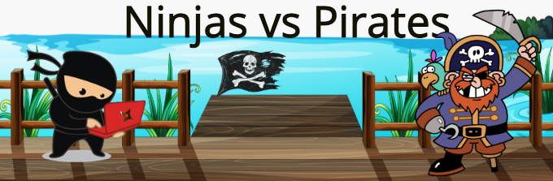

# OOP Hack-a-thon

## Coding Dojo Optional 06.19.2022

 

**Rules of Engagement**
* Use OOP to create console applications.
* Follow the instructors time line for completing game.

 

## **Option 1 : Deck of Cards**

**Challenge**
* Use the starter code to make a simple card game of your choice.
* Implement the rules of the card game.
* Make players to interact with the cards.
* Ninja Bonus: Use Inheritance, Class Methods, and Static Methods within your code.

Download Starter Code [HERE](https://login.codingdojo.com/m/506/12458/87339)

 

***06.19.2022:
Create a file for card game - high_card_win.py***

  

## **Option 2: Ninjas vs Pirates**

**Challenge**

* Use the starter code to make a RPG battle game between ninjas and pirates.
* Customize the attack methods on both the Ninja and Pirate class.
* Have an instance of a ninja and pirate battle it out until one's health is depleted.
* Ninja Bonus: Use Inheritance, Class Methods, and Static Methods within your code.

Download Starter Code [HERE](https://s3.us-east-1.amazonaws.com/General_V88/boomyeah2015/codingdojo/curriculum/content/chapter/1622739538__ninjas_vs_pirates.zip)
